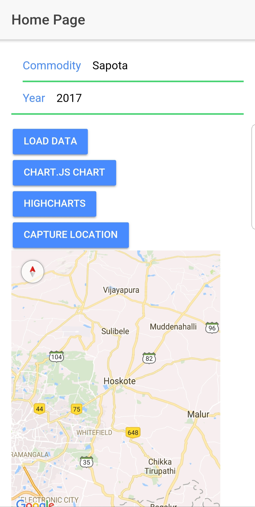
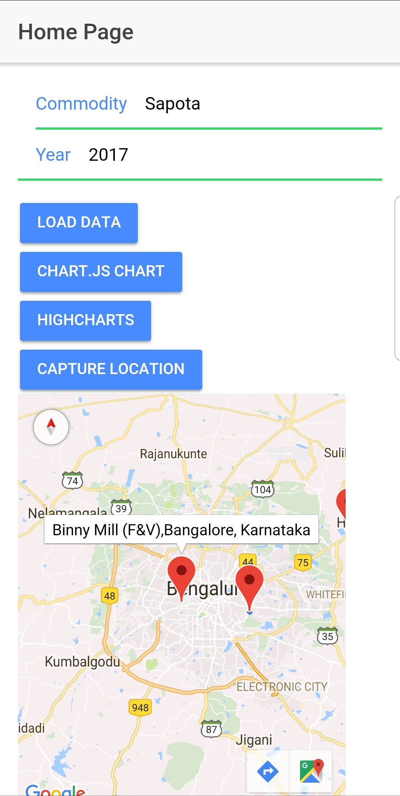
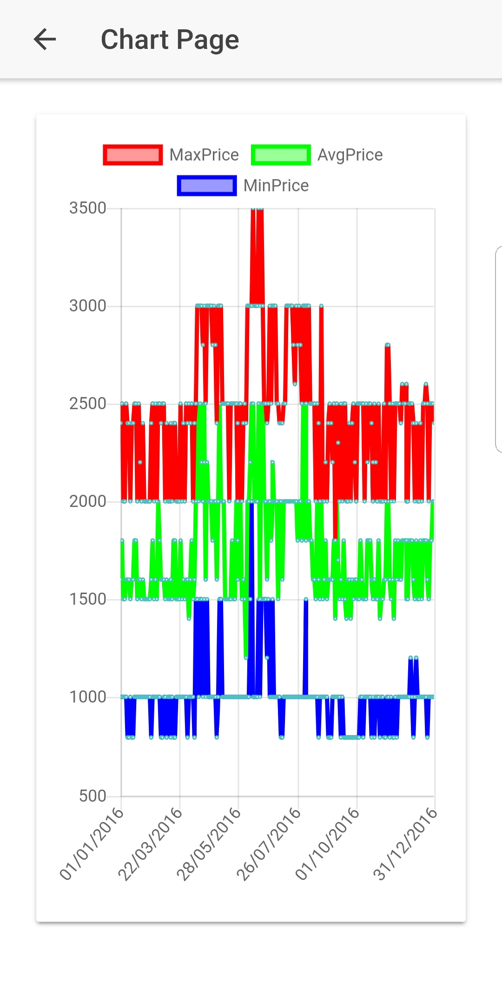
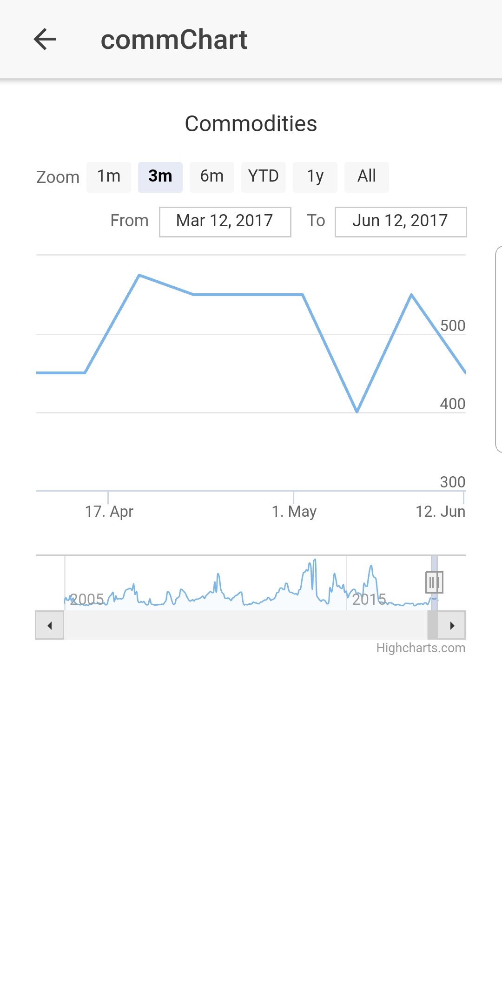

# Highcharts-Ionic-App
Ionic App to show working of Chart.js  library and Highchart using large data.

## Steps
- Add new google maps api key.
- Build and run your app.

## How to use app
- Enter the commodity name - Sapota.
- Enter the year - 2017.
 
 
- Click on load data button
- Click on capture location and then select the marker on the map for which the chart should be displayed.

- Select either Highcharts or Charts.js to show the working of respective type of charts

## Chart.js

## Highcharts

